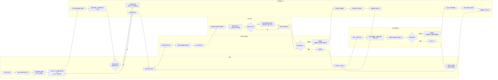

# 体系认证归档评定业务流程泳道图

> 可手动修改说明：下面使用 Mermaid `flowchart` 模拟泳道图。需要调整流程时，直接修改节点文案或箭头关系即可。

## 关键流程口径

- 初次提交：项目管理人员在 MSF11-20 必备材料齐全后，提交进入初次评定。
- 初次评定退回：项目管理人员补充材料后，重新提交进入初次评定。
- 初次评定通过：任务进入二次评定。
- 二次评定退回：项目管理人员补充材料后，重新提交直接进入二次评定，不再经过初次评定。
- 二次评定通过：本阶段业务结束，任务进入已完结。
- 评定问题登记对象：问题登记在 MSF11-20 材料清单项级别，不登记在具体文件行级别。

