# 体系归档业务实体关系图

> 可手动修改说明：下面使用 Mermaid `erDiagram` 描述实体关系。需要调整模型时，直接修改实体字段或关系线即可。

```mermaid
erDiagram
  CUSTOMER {
    string customer_id PK "客户ID"
    string customer_name "客户名称"
    string unified_social_credit_code "统一社会信用代码"
  }

  CERTIFICATION_PROJECT {
    string project_id PK "项目ID"
    string task_no UK "任务号，如 TASK-2026-001"
    string customer_id FK "客户ID"
    string audit_type_key FK "认证类型"
    string project_name "项目名称"
    string business_desc "业务描述，如四体系整合审核"
    string project_status "项目状态"
    datetime completed_at "项目完结时间"
  }

  SYSTEM_DICT {
    string system_code PK "体系编码：Q/E/S/F"
    string system_name "体系名称"
  }

  PROJECT_SYSTEM {
    string project_system_id PK "项目体系ID"
    string project_id FK "项目ID"
    string system_code FK "体系编码"
    string system_status "体系在当前流程中的状态"
  }

  AUDIT_TYPE {
    string audit_type_key PK "认证类型编码"
    string audit_type_label "认证类型名称"
  }

  ARCHIVE_TASK {
    string archive_task_id PK "归档任务ID"
    string project_id FK "项目ID"
    string archive_status "草稿/待提交/初次评定/初评退回/二次评定/二评退回/已完结"
    int required_item_count "必备材料项数"
    int completed_item_count "已齐全材料项数"
    decimal completeness_rate "完整率"
    string current_stage "当前阶段"
    datetime created_at "任务生成时间"
    datetime submitted_at "最近提交时间"
  }

  MATERIAL_CATALOG_ITEM {
    string material_id PK "MSF11-20 材料ID"
    string document_code "MSF11-20"
    string category "通用材料/一阶段材料/二阶段材料"
    string material_name "材料名称"
    string raw_applicable_systems "原始适用体系说明"
    int sort_order "排序"
    boolean active "是否启用"
  }

  MATERIAL_REQUIREMENT_RULE {
    string rule_id PK "材料规则ID"
    string material_id FK "材料ID"
    string audit_type_key FK "认证类型"
    string system_code FK "适用体系"
    boolean required "是否必备"
    string requirement_symbol "★/●/◆/空"
    string requirement_rule "规则口径"
  }

  ARCHIVE_TASK_MATERIAL {
    string task_material_id PK "任务材料项ID"
    string archive_task_id FK "归档任务ID"
    string material_id FK "材料ID"
    string material_status "缺失/已带入/已补充/有问题/已通过"
    boolean required "当前项目是否必交"
    int file_count "文件数"
    string missing_reason "缺失原因"
  }

  MATERIAL_FILE {
    string file_id PK "文件ID"
    string task_material_id FK "任务材料项ID"
    string file_name "具体文件名称"
    string file_source "前序带入/本地上传/资料库选择/在线表单"
    string storage_url "文件存储地址"
    string uploaded_by FK "上传人"
    datetime uploaded_at "上传时间"
    string evidence_desc "附件证据说明"
  }

  MATERIAL_FILE_SYSTEM {
    string file_system_id PK "文件适用体系ID"
    string file_id FK "文件ID"
    string system_code FK "体系编码"
  }

  STAGE_SUBMISSION {
    string submission_id PK "提交记录ID"
    string archive_task_id FK "归档任务ID"
    string from_status "提交前状态"
    string target_stage "初次评定/二次评定"
    string submitter_id FK "提交人"
    string submit_note "提交说明"
    datetime submitted_at "提交时间"
  }

  EVALUATION_TASK {
    string evaluation_task_id PK "评定任务ID"
    string archive_task_id FK "归档任务ID"
    string stage "initial/second"
    string evaluation_status "待指派/评审中/退回/通过"
    string dispatcher_id FK "评定管理员"
    datetime assigned_at "指派时间"
    datetime completed_at "完成时间"
  }

  EXPERT_ASSIGNMENT {
    string assignment_id PK "专家指派ID"
    string evaluation_task_id FK "评定任务ID"
    string expert_id FK "专家ID"
    string system_code FK "授权评审体系"
    string assignment_status "待评审/评审中/已提交"
  }

  EXPERT_REVIEW_RESULT {
    string review_result_id PK "专家评审结果ID"
    string assignment_id FK "专家指派ID"
    string conclusion "通过/有问题/需补充"
    string review_note "评审意见"
    datetime submitted_at "提交时间"
  }

  REVIEW_ISSUE {
    string issue_id PK "问题ID"
    string evaluation_task_id FK "评定任务ID"
    string task_material_id FK "任务材料项ID"
    string system_code FK "涉及体系"
    string issue_type "问题类型"
    string issue_desc "问题描述"
    string issue_status "有效/已处理/关闭"
    string raised_by FK "提交人"
    datetime raised_at "提交时间"
  }

  RETURN_RECORD {
    string return_id PK "退回记录ID"
    string evaluation_task_id FK "评定任务ID"
    string archive_task_id FK "归档任务ID"
    string return_stage "初次评定/二次评定"
    string return_reason "退回原因"
    string returned_by FK "退回人"
    datetime returned_at "退回时间"
  }

  USER_ACCOUNT {
    string user_id PK "用户ID"
    string user_name "姓名"
    string role_type "项目管理人员/初评管理员/二评管理员/专家"
    string org_name "所属组织"
  }

  CUSTOMER ||--o{ CERTIFICATION_PROJECT : "拥有项目"
  AUDIT_TYPE ||--o{ CERTIFICATION_PROJECT : "定义认证类型"
  CERTIFICATION_PROJECT ||--o{ PROJECT_SYSTEM : "覆盖体系"
  SYSTEM_DICT ||--o{ PROJECT_SYSTEM : "体系字典"
  CERTIFICATION_PROJECT ||--|| ARCHIVE_TASK : "生成归档任务"

  MATERIAL_CATALOG_ITEM ||--o{ MATERIAL_REQUIREMENT_RULE : "定义适用和必备规则"
  AUDIT_TYPE ||--o{ MATERIAL_REQUIREMENT_RULE : "按认证类型限定"
  SYSTEM_DICT ||--o{ MATERIAL_REQUIREMENT_RULE : "按体系限定"

  ARCHIVE_TASK ||--o{ ARCHIVE_TASK_MATERIAL : "实例化48项材料"
  MATERIAL_CATALOG_ITEM ||--o{ ARCHIVE_TASK_MATERIAL : "来自权威清单"
  ARCHIVE_TASK_MATERIAL ||--o{ MATERIAL_FILE : "包含附件证据"
  MATERIAL_FILE ||--o{ MATERIAL_FILE_SYSTEM : "覆盖体系"
  SYSTEM_DICT ||--o{ MATERIAL_FILE_SYSTEM : "体系字典"

  ARCHIVE_TASK ||--o{ STAGE_SUBMISSION : "产生提交记录"
  USER_ACCOUNT ||--o{ STAGE_SUBMISSION : "提交"

  ARCHIVE_TASK ||--o{ EVALUATION_TASK : "进入评定阶段"
  USER_ACCOUNT ||--o{ EVALUATION_TASK : "调度管理"
  EVALUATION_TASK ||--o{ EXPERT_ASSIGNMENT : "指派专家"
  USER_ACCOUNT ||--o{ EXPERT_ASSIGNMENT : "专家"
  SYSTEM_DICT ||--o{ EXPERT_ASSIGNMENT : "授权体系"
  EXPERT_ASSIGNMENT ||--o{ EXPERT_REVIEW_RESULT : "提交结果"

  EVALUATION_TASK ||--o{ REVIEW_ISSUE : "登记问题"
  ARCHIVE_TASK_MATERIAL ||--o{ REVIEW_ISSUE : "问题归属材料项"
  SYSTEM_DICT ||--o{ REVIEW_ISSUE : "涉及体系"
  USER_ACCOUNT ||--o{ REVIEW_ISSUE : "提交问题"

  EVALUATION_TASK ||--o{ RETURN_RECORD : "可退回"
  ARCHIVE_TASK ||--o{ RETURN_RECORD : "记录退回历史"
  USER_ACCOUNT ||--o{ RETURN_RECORD : "执行退回"
```

## 建模口径

- `MATERIAL_CATALOG_ITEM` 是 MSF11-20 的 48 项权威材料清单。
- `ARCHIVE_TASK_MATERIAL` 是某个归档任务下的材料项实例，材料缺失、文件数、问题状态都落在这里。
- `MATERIAL_FILE` 是材料项下的附件证据，不承载评定结论。
- `REVIEW_ISSUE` 关联 `ARCHIVE_TASK_MATERIAL`，不直接关联 `MATERIAL_FILE`，符合“问题登记在材料清单项级别”的规则。
- `EVALUATION_TASK.stage` 区分初次评定和二次评定。
- 二次评定退回后的再次提交，可通过 `STAGE_SUBMISSION.target_stage = 二次评定` 表达，不再生成新的初次评定提交路径。

